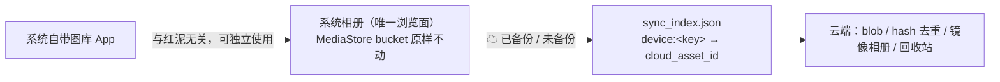

# 红泥（hongni）架构说明

轻量自托管云相册：单二进制 Go 服务端 + SQLite 索引 + 磁盘 blob 文件，Godot 客户端（Android 优先），参考 immich 但无 Docker、无外部数据库。

## 总体结构

```
hongni/
├── server/                  # Go 服务端（单二进制）
│   ├── main.go              # 装配 / 优雅关闭 / mDNS 注册
│   └── internal/
│       ├── config/          # 环境变量 + 令牌生成/持久化
│       ├── store/           # SQLite 迁移 + 数据访问 + sync_log
│       ├── blob/            # 内容寻址存储 + 缩略图
│       └── api/             # 路由 + 令牌鉴权 + 身份会话中间件 + handlers
└── app/                     # Godot 4.7 客户端（竖屏）
    ├── project.godot        # 自动加载单例 + 竖屏配置
    ├── plugin-android/      # 插件 Kotlin 源码 + gradle 工程（构建 AAR）
    ├── scenes/              # main / albums / album_view / viewer / settings / trash
    ├── scripts/             # GDScript：Store/Api/Sync/Lock/Cache/DeviceMedia + 场景脚本 + media_probe（容器元数据解析）/ asset_menu（资材操作菜单）/ details_sheet（详细面板）
    └── addons/hongni_plugin # Android 插件 AAR + 导出脚本
```

## 服务端

### 数据目录

`HONGNI_DATA_DIR`（默认 `./data`）：

```
data/
├── hongni.db      # SQLite 索引（WAL）：资产 / 相册 / 身份
├── config.json    # 生成的共享 Bearer 令牌
├── blobs/<h0>/<h1>/<hash>   # 原始文件（内容寻址，无扩展名）
└── thumbs/<h0>/<h1>/<hash>.jpg  # 缩略图（最长边 512px）
```

### 存储模型（内容寻址 + 引用计数）

- **blobs**：`hash`（SHA-256 hex，主键）、`size`、`ref_count`。物理文件内容寻址、无扩展名。
- **assets**：一条上传记录 = 一个名字 + 一个 hash 引用。索引记录**原始扩展名**（`ext`，上传时从原始文件名提取、改名不影响），使内容寻址的 blob 即使在 `original_name` 被改掉后仍能还原真实文件类型。同名/不同名重复内容共享同一 blob。
- **album_assets**：成员关系（`album_id` + `asset_id` + `added_at` + `name`）。**名字可以分两层**：`assets.original_name` 是文件自己的名字，`album_assets.name` 是它在**这个相册里**的名字（为避重名编号时才写，NULL = 用文件自己的名字）。同一个资产因此在 A 相册叫 `x.png`、在 B 相册叫 `x (1).png`，而 `assets` 只有一行、blob 只有一份。
- 去重语义：上传同内容文件 → `blobs` 行不变，新增 `assets` 行，`ref_count + 1`。但**同一个相册里不会留下两份同内容**：落进相册的上传与成员添加都先按内容判重（同 hash 并进已有那条），名字冲突时给后进的成员编号 —— 规则见「底部操作行与资材菜单」。
- 删除语义：删 `assets` → `ref_count - 1`；归零时同事务删除 `blobs` 行，并移除物理 blob + 缩略图。
- **albums**：树形（`parent_id` 自引用级联删除），`is_hidden`、`sync_mode`（`backup/two_way/mirror/local_only`）、`owner_id`。**`owner_id` 就是「谁看得见」**：`NULL` = 全家共享（`共享相册` 主干及其子树），非 NULL = 某个身份自己的隐私子树（`隐私` 主干 + 它下面的一切）。子相册建在谁下面就归谁（`CreateAlbum` 继承父级 owner、`MoveAlbum` 随落点改 owner、`childAlbumTx` 重建相册时跟随主干），所以「一个相册归谁」永远只有一个来源。**相册封面不进服务端**：由客户端按设备记在 `settings.json` 的 `album_covers`（相册 id → asset id），换设备/清数据后回到「相册最新一张」。
- **identities**：家庭成员。`name` 唯一，`pin_salt`/`pin_hash`/`iterations`（PBKDF2-HMAC-SHA256，PIN 从不落明文；迭代数逐行保存，将来调高成本不会让旧行失效），`created_at`。**首次注册为准**：某个名字第一次出现在 `POST /identity/login` 时就用本次 PIN 注册，并同时把它的 隐私 主干配好（见下）；之后再出现这个名字必须对上 PIN。没有找回 PIN 的入口——忘记就等于失去那个身份的隐私相册。
- **album_assets**：多对多成员关系，不产生新 asset。
- **sync_log**：增量变更日志（`entity`/`entity_id`/`op`/`seq`），供多设备同步游标。

### 配置与鉴权（两层：结点令牌 + 身份）

- 环境变量：`HONGNI_DATA_DIR`、`HONGNI_ADDR`（默认 `:8354`）、`HONGNI_TOKEN`（可选）。
- 令牌为空时从 `config.json` 读；仍无则 `crypto/rand` 生成 32 字节 hex 持久化并打印一次。
- **第一层（结点令牌）**：`/health` 无需鉴权；`/api/v1/*` 全部要求 `Authorization: Bearer <token>`，`crypto/subtle.ConstantTimeCompare` 比对。它挡的是局域网里还没有令牌的设备。
- **第二层（身份）**：`POST /api/v1/identity/login`（`{"identity","pin"}`）是唯一只要令牌就能调的数据路由，成功回 `{"session","identity","private_trunk_id","shared_trunk_id","registered"}`。其余数据路由再要求 `X-Hongni-Session: <session>`，服务端据此决定这次请求看得见哪些相册（见下「可见性」）。会话**只在服务端内存**（`sync.RWMutex` 保护的表），重启即全部失效——客户端拿存着的 身份 ID + PIN 自动重登，用户无感。
- 形状校验在 handler：身份名去空白后 1–32 个字符、PIN 4–6 位数字；`身份 ID 或 PIN 不正确`、`当前 PIN 不正确`、`未登录` 这些文案直接给用户看。`POST /api/v1/identity/pin`（`{"pin","new_pin"}`）先校验旧 PIN，成功则**作废该身份的全部旧会话**并返回本次调用者的新会话。
- 令牌与身份 PIN 都明文存在客户端 `settings.json`（自动重登需要），4–6 位 PIN 在局域网内可被暴力枚举：不做限流与锁定，与原先家长 PIN 的强度一致。

### 可见性（服务端是唯一真相）

客户端不参与判断「该不该看到」——服务端从会话取身份，把不属于它的东西当作不存在（`ErrNotFound` → 404），所以别人的隐私相册不仅列不出来，连按 id 直接取也取不到。

- 能看到的**相册** = `owner_id IS NULL OR owner_id = ?`（`visibleAlbumCond`）：共享的，加上自己的。`VisibleAlbum` 是入口，`ListAlbums`/`CreateAlbum`/`MoveAlbum`/`ListTrash`/`ClearTrash`/`AddAssetToAlbum`/`RemoveOrTrash`/`RemoveOrPark` 都先过它。
- 能看到的**资材** = 被可见相册收着（活跃成员关系），或者躺在可见主干的回收站里（`assetVisibleCond`）。`GetAssetVisible` 是入口，`ListAssets`/`GetAssetByHash`/`GetChanges` 也按同一条件过滤，所以增量同步里不会漏出别人的照片 id。
- `GET /assets/by-hash/{hash}` 同样按可见范围找：同内容别人先传过时，你看不到他那条，于是自己传一遍会**新建一条 assets 行共享同一个 blob**（字节只存一份，行各归各的相册）。
- 身份切换的清理是客户端的事：`Api._adopt_identity` 发现结点记住的 `identity_id` 变了就 `_reset_for_identity()`——清掉云端相册快照、缩略图/原件缓存、同步游标与浏览上下文，并重新上锁（否则上一个身份的隐私相册会以缓存的形式留在屏幕上）。
- **升级旧库**：新库启动时不再种全局 `隐私` 主干（它现在必须归某个人）。第一个注册的身份会**收编**老库里那棵无主的 `隐私` 主干（连同它的 收藏/散照/子相册整棵子树一起改 `owner_id`），旧照片因此跟着归它；之后注册的身份各得一棵新的空 `隐私`。

### 依赖（纯 Go，无 CGO）

- `modernc.org/sqlite` — 纯 Go SQLite 驱动
- `golang.org/x/image` — WebP 解码 + 高质量缩放
- `github.com/grandcat/zeroconf` — mDNS `_hongni._tcp` 局域网发现

## 客户端

### 单例（autoload）

| 单例 | 职责 |
|---|---|
| `Store` | `user://settings.json`（服务器结点列表（每个结点带 身份 ID/PIN/上次登录的 `identity_id`）/游标/存储策略/相册封面 `album_covers`）与 `user://sync_index.json`（设备项 → 云端资产映射）持久化。索引另建 `local_id` 哈希表缓存：同步对每个文件都要查一次，线性扫描会让整趟变成 O(n²)。**落盘可批量**：`begin_batch()`/`end_batch()` 之内的写入只标脏，出批时与 `flush()` 各写一次（同步一趟上传几千张时，逐条重写整份索引就是 O(n²) 字节）；内存态始终是最新的，没落盘的那点最多在下一趟重挂/重传一次，方向安全。退到后台或退出时也会 flush |
| `Api` | HTTP 客户端，返回 `Dictionary`（`error` 非空即失败）；请求按结点优先级失败切换；**每个结点带自己的会话**（`X-Hongni-Session`），没有会话或会话失效（401）时用该结点存的身份 ID + PIN 自动重登一次再重试（服务器重启后客户端无需打扰用户）；登录换到的身份与结点里记的 `identity_id` 不同就 `_reset_for_identity()` 清掉上一个身份的缓存、游标与浏览上下文并重新上锁；多段上传、缩略图/原图拉取；`resolve_device_album` 按设备相册名找/建同名云端相册。**全局限并发 6**（`MAX_CONCURRENT_REQUESTS`）：网格一批渲染 150 格、每格缩略图各是一个请求，不设闸就是同时开 150+ 连接——弱网/掉线时变成一堆并行超时，还会挤掉真正要紧的请求（同步上传、查看器原图）；超出的请求按帧等空位 |
| `Sync` | 备份引擎（系统相册驱动）：扫设备 → 镜像上传（按内容 hash 去重）→ 写 `sync_index` → 把设备端删除镜像为云端软删除 → 拉取云端变更 → 空间回收 |
| `Lock` | 身份 PIN/指纹门禁：本地用绝对定长时间比较核对**结点里那一个身份 PIN**（与服务器认的是同一个秘密——不必再存第二份会失同步的哈希，也天然离线可用），代理插件 MediaStore/PhotoPicker/mDNS 能力 |
| `Cache` | 离线缓存：云端相册快照、缩略图/原件缓存、LRU 空间清理。只碰 `user://cache`，永不碰设备文件 |
| `DeviceMedia` | 系统相册数据源：MediaStore（Android，按 `_ID` 分页读到末尾）/ Pictures 目录（桌面）扫描、按相册分组、缩略图生产与缓存、上传暂存与播放取文件；`scan_items()` 给同步引擎一份不打断缩略图线程的新扫描，`scan_is_complete()` 报告这一趟是否真读全了（权限 + 分页都算数） |

### 界面缩放（viewport / stretch）

- `project.godot` 的 `[display]` 按 lingwang 的做法：`window/stretch/mode="canvas_items"` + `window/stretch/aspect="expand"`，基准视口 **600×1280**。基准宽＝设计宽，**缩放比 = 屏幕物理宽 / 基准宽**，所以这个数就是「字多大」的唯一旋钮：华为 P50（1224×2700，456ppi）上 600 给出 **2.04×**（逻辑视口 600×1323），`font_size=20` 的正文＝40.8 物理像素 ≈ **14.3sp**，与 Android 正文字号（14sp）对齐；同尺寸下 720 只有 12.0sp、648 是 13.3sp（都低于 Android 正文标准）。1080 宽的手机上是 1.8×（12.6sp）。桌面窗口就是 600×1280，1:1。
- **基准宽度不能随便再小**：照片网格 4 列 × `THUMB_SIZE`(140) + 3×4 是硬约束（600 下 572/600，600 也是 `THUMB_SIZE` 不用跟着缩的最小值）。相册卡片网格**不再是约束**：它没有固定尺寸，两列把屏幕宽度（减去 16 间距与滚动条）自己分掉，基准宽改成多少它都刚好铺满（改基准宽只需验照片网格）。
- **相册卡片跟着屏幕走**：卡片没有 `CARD_SIZE` 这种固定尺寸了——`albums.gd::_make_card` 只给高度（`_card_height()`＝实测列宽 × 276/288），宽度由 `GridContainer` 两列 `SIZE_EXPAND_FILL` 分给它们，封面走 `expand_icon` 缩放着画、名字 `clip_text`，所以**封面多大都不会撑开列宽**。原先卡片封面的逻辑宽度＝解码出的物理像素（`thumb_px(288)` 在 P50 上是 588），一列就占满整屏、第二列被挤出屏幕；现在卡片列宽 = 实测宽度（600 宽视口上是 292），旋转/改窗口大小由 `get_viewport().size_changed` 重算高度。
- **触摸目标按 dp 兜底**：顶栏 `← 返回` 与 albums 右上角 `+`/`⋮` 都给 `72` 逻辑像素高（`BACK_BTN_H` / `TOP_BTN_SIZE`），在 P50 上是 147 物理像素 ≈ 51.6dp，满足 Android 48dp 下限；默认主题按钮只有 ~31 逻辑像素高（≈18dp），手指按不准。底部操作行的 ⋮ 仍是 44。
- **缩略图跟着缩放走**：`DeviceMedia.display_scale()`＝物理宽/逻辑宽，`thumb_px()` 把逻辑尺寸折成物理尺寸再解码（P50 上照片网格 140→286、相册卡片列宽 292→596），缓存文件名带物理尺寸（`…_286.png`），否则网格里显示的是小图放大后的糊图。云端缩略图由服务端按 512px 生成：只有比「屏幕上实际显示多大」更大时才降采样，等比缩放（不再压成 288×243 那种变形的封面）。
- **真机要躲开刘海与屏幕圆角**：手机是全屏（`screen/immersive_mode=true`）的，画面铺满整屏，刘海/挖孔与屏幕左右上角的圆角都压在顶栏上——顶栏两端正好落在圆角里被切。五个界面（`albums` / `album_view` / `trash` / `settings` / `viewer`）在 `_build_ui` 建完铺满全屏的根容器后各一行 `SAFE_AREA.apply(root)`，把整个界面下移一条安全区带（参考 lingwang 的 `ui_main.gd::_apply_safe_area`，那边是 `NotchBar` 垫高 + `SafeAreaContent.offset_top`）。与 lingwang 的两处不同：`DisplayServer.get_display_safe_area()` 报的是**物理像素**，得先按 `DeviceMedia.display_scale()` 折成画布单位才是偏移量（否则 1200 万像素的机器上会多留一倍，lingwang 是靠 clamp 到 36 掩过去的）；桌面/编辑器上一律留 0——`get_display_safe_area()` 在桌面上给的是**屏幕**可用区（任务栏那块），当窗口偏移用没有意义。系统报 0（屏幕只有圆角、没有挖孔）时仍留 `MIN_TOP=36`，否则圆角照切：600 宽的画布上是 6%，P50（1224 宽）上是 73 物理像素 ≈ 25dp，与 lingwang 的上限同一个数。`viewer` 是唯一的例外：垫的不是整页而是一条 `top_pad` 空档，点按隐藏周边 UI 时它跟着收起，照片/视频照样铺满整屏。

### 服务器结点（多结点与优先级）

`settings.json` 的 `servers` 是结点数组，**数组顺序即优先级**，每项 `{name, url, token, identity, pin, identity_id}`。`identity`/`pin` 是这台设备在这个结点上的 身份 ID 与 PIN；`identity_id` 是上次登录成功时服务器返回的身份 id，用来判断「这次登录回来的是不是同一个人」（换了身份或换了服务器都要把它清成 0，否则会拿着别人的 `identity_id` 去比对）。旧版单服务器字段 `server_url`/`token` 在首次加载时迁移为唯一结点（名称默认取地址的 host:port）后删除，旧版存下来的 `master_pin_hash`/`master_pin_salt` 直接擦掉（PIN 现在归身份，本地不再存哈希）。

**只有带齐 地址 + 令牌 + 身份 ID + PIN 的结点才算「配置好了」**（`Store.is_configured`），所以升级后老结点会被判为未配置，启动直接进设置页补填身份与 PIN——这就是这次升级的切换点。

- 请求路由（`Api._do_request`）：先试上次成功的结点，再按优先级依次试其余结点。每个结点先确保有会话（`_ensure_login`，同一结点的并发请求只登一次），只有**连不上**（地址非法/DNS/超时）才切下一个；结点答了但身份/PIN 或令牌不对时把这句话记下来继续试别的结点，都不行才把它还给用户（比「均不可达」有用得多）。任一结点给出数据响应即视为该结点生效并记住它；数据路由回 401 说明会话过期，丢掉会话自动重登一次再重试。稳态无额外开销；结点掉线只在切换那一刻付一次超时。
- 设置页「服务器」区每行一个结点：**连通性圆点**（灰=未知/检测中、绿=可达、红=不可达；进页面与「检测连接」时并发探测 `/health`）+ **名称** + **▲/▼**（调顺序即调优先级）+ **设置**。整页是单列滚动布局，**返回键固定在左上角**（与标题同一行），其余分区依次向下：服务器 / 本地存储。
- 「设置」打开子 UI：名称、地址（旁有「扫描局域网」填入）、令牌、**身份 ID**、**PIN**、**登录测试**（`POST /identity/login`；身份首次出现时会顺带把它注册出来，所以文案区分「已注册并登录：X（首次注册已设定 PIN）」与「已登录：X」，失败则原样显示服务器的 `身份 ID 或 PIN 不正确`）、**修改 PIN**（只对当前生效的结点显示：请求带的会话就是它的；弹窗收当前 PIN 与新 PIN，成功后服务器作废该身份的旧会话并把本机存的 PIN 一起更新）、**删除**，以及取消/保存；新建结点不显示删除与修改 PIN；测试用输入框里的未保存值，结果同时回填该行圆点。保存会清空在飞的会话（存下的结点可能带着另一个身份或另一个 PIN）。
- `Api.probe_all` 并发发出全部 `/health` 请求，结果由各自回调收集——**不能逐个 `await request_completed`**：该信号只触发一次，快结点会在等待慢结点期间就绪而被永久错过。

### 场景流

```
main.tscn ──无可用结点──▶ settings.tscn ──结点连得上──▶ albums.tscn
albums.tscn ──顶部三个并列 tab:共享相册 | 系统相册 | 隐私相册──▶ 三套相册平级切换（默认落在 系统相册）
albums.tscn ──相册卡片（两列、宽度自适应屏幕）──▶ album_view.tscn
   系统相册 = 全部 / 视频 / 各本机相册（设备自己的相册）   共享相册 = 收藏 / 全部 / 视频 / 各子相册（全家可见可操作）
   隐私相册 = 本人的隐藏相册（身份 PIN/指纹门禁，结构与共享相册一致，服务端只发给这个身份）
album_view.tscn ──点击照片/视频──▶ viewer.tscn（全屏原图、左右滑；点按切换周边 UI；视频默认不播，点按才播，Android 走应用内播放 + 预览帧进度条、否则外部播放器）
album_view.tscn ──长按或底部「选择」──▶ 多选模式（每格右上勾选框）──▶ 底部 ⋮ 菜单批量执行
   云端资材：收藏 / 移动到 / 复制到 / 设为相册封面 / 重命名 / 删除 / 删本地保云端    本机资材：移动到 / 复制到 / 删本地保云端 / 从本机删除
viewer.tscn ──底部 ⋮ 菜单──▶ 收藏/移动到/复制到/设为相册封面/重命名/删除/删本地保云端/详细（作用于当前这张；本机资材为 移动到/复制到/删本地保云端/从本机删除/详细）
albums.tscn ──相册卡片长按──▶ 移动到 / 复制到（目标只有三大主干根）/ 改名 / 删除相册（云端真实子相册，**非空才二次确认**；本机相册卡片只有 移动到/复制到 两大云端主干；虚相册 全部/视频、主干与 收藏 没有这些项）
albums.tscn ──⋮ 菜单（最近删除/立即同步/设置）──▶ trash.tscn（恢复 / 永久删除 / 清空，主/隐私分离）
album_view/viewer/trash/settings ──返回──▶ albums.tscn（回到本会话最后所在的主干 `Api.current_trunk`，默认 系统相册；隐私主干仅在会话已解锁时恢复）
```

设备网格每格右上角的 `☁` 表示**这一项已经备份**（`sync_index` 里有 `device:` 记录），`↓` 表示云端资材在本机没有原件。系统相册就是浏览面：设备照旧用自己的存储、系统图库 App 不受影响，红泥只在上面叠一层云状态。



### 三套并列的相册

- **系统相册**是本机的相册，数据直读设备：Android 走 MediaStore（插件 `list_media` 返回 `bucket_id`/`bucket_name`，据此分组出各本机相册），桌面/编辑器走 `%USERPROFILE%\Pictures`（一级子目录即一个相册，根目录文件归入「图片」）。该主干完全不依赖服务器，离线可用，是 App 的默认入口——浏览在这里发生，云端只以每格的 `☁` 已备份角标和镜像相册出现。
- **共享相册**（云端主干 `共享相册`，全库唯一、没有主人）是全家共享的那一层：任何身份都能看、都能操作，系统相册镜像出来的相册、收藏、回收站都在这里。**隐私相册**（云端主干 `隐私`，`is_hidden`，`owner_id` = 本人）只发给这个身份——它在服务端的可见性由 `owner_id` 决定，客户端只管在进入时验 PIN。
- 三个主干共用同一套界面：相册卡片网格（`albums.tscn`）与照片网格（`album_view.tscn`）+ 查看器 + 多选 + 底部 ⋮ 菜单。云端卡片长按是相册菜单 **移动到 / 复制到 / 改名 / 删除相册**（后两者只对真实子相册开，删除见下）；本机相册卡片长按是 **移动到 / 复制到**（设备自己的相册没有改名/删除，虚相册 全部/视频 与主干、收藏 不弹菜单）。
- 相册级 **移动/复制只以三大主干根为目标**（`TargetId`：共享相册 / 隐私相册 / 系统相册），相册不会被塞进另一个相册的子层级；相册**里的照片**才自由得多（见下一节的文件级选择器）。
  - **移动到**（云端相册）：交给服务端一个事务做（`POST /albums/{id}/move`）——挂到目标主干下，目标处已有同名相册就**合并**（资产并入幸存者、子相册改挂、原相册删除），`is_hidden` 与 `owner_id` 都由新父级继承（搬进 隐私 自动隐藏且从此归自己，搬回根就重新成为全家的）。
  - **复制到**（云端相册）：`_duplicate_album` 在目标主干下找/建同名相册（同名即合并，和移动一致），再逐个 `add_asset_to_album` 把成员挂过去——资产是**共享**的，不重传字节。
  - **系统相册目标**：`Sync.export_assets_to_device` 把成员写到 `Pictures/红泥`（Android 只能免确认地加自己的媒体），复制到此为止；移动到再把云端那份软删进回收站，并在**每一项都成功搬出**之后删掉腾空的相册（还有子相册、或有视频被跳过时保留，别把没搬走的资产变成孤儿）。
  - **本机相册 → 云端**（`_upload_device_album`）：逐个 `Sync.upload_device_item` 上传，共享相册按本机相册名归位（`Api.resolve_device_album`）、隐私相册落进它的 `散照`；**移动到**在本机那份的云端副本确实存在之后，才调用系统删除（Android 弹自己的确认框）。
  - **删除相册**（云端真实子相册，`albums.gd::_delete_album`）：**空相册**（无成员、无子相册）点一下就走；**非空相册**先弹一次 `ConfirmationDialog`（文案给出成员数与子相册名，超过首页 100 项时说「超过 N 张」）——删相册会连带整棵子相册树，值得问一句。服务端 `DELETE /albums/{id}` 在一个事务里做两件事：把**除这棵子树外没人持有的**成员逐个软删进回收站（`deleted_trunk_id` = 子相册所在主干、`deleted_album_id` + `deleted_album_name` = 被删的那个相册，所以 30 天内在 最近删除 里**按散件**恢复时，相册按名字重建——同名已存在就并进去，`is_hidden` 随主干）；随后才删相册行，`parent_id ... ON DELETE CASCADE` 扫掉子相册与成员关系。与别的相册**共享**的照片不动（它在那边的相册里照常可见），本机那份设备文件也从不碰。整棵子树被级联删掉的相册 id 逐个写 `sync_log`，游标看不到「删一个、少仨」的黑洞。删除没有 PIN 门禁（见下），也**不**能读到相册内容时按「非空」处理：宁可疑问一次也不冒盲删级联的险。
- **收藏是视图，不是收纳盒**：服务端确实为每个主干存了一行 `收藏`（成员关系即 `album_assets`，多设备同步），但界面上它是「星标视图」——不作为 移动/复制 的目标，空了不显示卡片，⋮ 菜单里**只有 收藏/取消收藏，没有 删除/移动到/复制到**（viewer 的「删除」按钮是另一条入口，用同一个判定 `asset_menu.in_favorites_view()` 一起隐藏）：在视图里既删又搬正是照片最后无家可归的来源。**取消收藏**若是它最后一处归属，服务端把它归到该主干的 `散照`（`store.RemoveOrPark`，必要时把桶补出来、按同名规则编号），并回报 `parked` 让客户端提示一句 —— 取消星标不该是隐藏的删除。真正的虚相册只有 全部/视频（服务端没有对应行）。注意服务端的 `AlbumScopedDelete` 仍把 收藏 当整库视图（原生 API / 老客户端在那里删＝删照片），界面只是不再提供这个入口。
- **虚相册**（没有对应的服务端相册行，只是同一批资材的另一种看法）：
  - **全部**＝主干自身（服务端聚合其全部后代相册的成员）。
  - **视频**＝「全部」再按媒体类型过滤（`GET /assets?filter=videos&album_id=<主干>`），主干里一张视频都没有时不显示这张卡片；本机主干走 `DeviceMedia.bucket_items(VIDEO_BUCKET)`（`is_video` 过滤），同样为空时不显示。点开后 `Api.current_filter = "videos"`，网格/查看器/多选/⋮ 菜单与「全部」完全一致（移动时同样按「脱离散照」处理）。
  - 离线缓存按「相册 id + filter」分别存（`Cache.offline_assets(id, filter)`；filter 为 `all` 时沿用旧的裸 id 键），所以 VIDEO 视图不会覆盖「全部」的快照。
- 系统主干的资材是**设备自己的文件**（Android 为 `content://` URI，桌面为绝对路径）：网格缩略图与相册卡片封面（`albums.gd` 的一张一封面）同由 `DeviceMedia` 生成并缓存到 `user://system_thumbs`（Android 经插件 `load_thumbnail` 在调用线程解码，按帧限流——网格与卡片各自按帧摊；桌面由后台线程解码）；查看器用插件 `load_media_preview`（保比例、不裁剪）或桌面直接解码；视频仍走应用内/外部播放（点 ▶ 后 Android 才把 `content://` 落到 `user://cache/device` 再交给 MediaPlayer）。
- 设备文件归设备和系统图库 App 所有，红泥**只在自己发起**的 移动/删除 里才动它（`DeviceMedia.delete_items`）：Android 走 MediaStore 的删除请求，**系统一定弹确认框**，所以「删没删掉」以重新扫描为准——拒绝确认就什么都没发生。桌面直接 unlink。
- **⋮ 菜单 → 移动到 / 复制到** 把选中项送进云端：暂存到隐藏目录 `user://import_tmp` → 算 SHA-256 → `Api.asset_by_hash` 命中就把已有资产挂进相册（不重传字节）→ 否则 `Api.upload_asset` 传进**按设备相册名镜像出来的云端相册**（`Api.resolve_device_album(bucket_name)`，保留名回落 `散照`）→ 在 `sync_index` 写下 `device:<key> → asset_id`，网格随即显示 `☁`；最后删掉暂存副本。**复制到**到此为止；**移动到**在云端副本确实存在之后，再删掉本机那份。

### 底部操作行与资材菜单

- `album_view`（照片网格）与 `viewer`（全屏）底部各有一行操作按钮，**最右侧固定为 ⋮ 菜单**（`asset_menu.gd`，两个界面共用）：收藏 / 移动到 / 复制到 / 设为相册封面 / 重命名 / 删除 / 删本地保云端 / 详细。网格里这组操作原先是**长按弹出**；现在长按改为**切换进多选模式**（每格右上角出现勾选框，`↓` 云角标让位隐藏），⋮ 菜单于是按「当前选中项」批量执行，未选中时回退到最近点过的那一张。viewer 的删除/存到相册按钮移到同一行，原本的「加入相册（输入相册 ID）」由菜单里的 移动到/复制到（相册选择器）取代。
- 目标是**系统相册**的本机资材时，菜单换成 **移动到 / 复制到 / 删本地保云端 / 从本机删除 / 详细**（云端专属项一律不出现），viewer 同时隐藏「存到相册」——设备文件归设备所有。**删除要过系统确认框**（别的 App 的媒体不能静默删），所以判定以重新扫描为准。
- **删本地保云端**（`Store.is_kept` / `settings.json` 的 `keep_assets`）＝**立刻手动释放本机空间，云端不动**，一个菜单项干完两件事。它先给云端那份打上**保留标记**——这是唯一一道「本机删了、云端留着」的豁免：没有标记时，设备文件消失会在下次同步把云端那份一并送进回收站，打了标记就只摘掉索引条目——然后**当场删掉本机原图**：云端资材删的是本机缓存的原图下载（`Cache.remove_original_by_id`），系统相册资材删的是设备自己的文件（照样过系统确认框，只给真的消失了的那些打标记）。**缩略图与相册成员关系都不动**：当前网格连格子和画面都不重绘（`changed` 不发），格子留到下次重新查看才换样子——云端资材届时带 `↓` 只存云角标、再查看时按需把原图重新下载下来，设备项则不再出现在设备列表里。它没有开关也不可撤销（本机那份下次要用自己会回来）；本机确实没有原图可删时只打标记并照样提示。设备项上这一项只有备份过才可点（要对云端那份打标）。
- 菜单项 **设为相册封面** 只对**单张云端图片**开放（视频服务端不解码、没有缩略图；多选没有唯一封面；尚未上传的本地图片没有云端记录），视频/多选/本地图片一律置灰。封面**只记在本机** `settings.json` 的 `album_covers`（相册 id → asset id），服务端不存、相册成员关系不动，所以也不依赖联网：相册卡片缩略图优先用该封面，封面照片取不到缩略图（离线未缓存、已删除）时退回相册最新一张。
- 移动到 / 复制到 **共用同一个目标选择器**（`AcceptDialog` + 下拉框）。目标是三种之一（`TargetKind`）：**共享相册 / 隐私相册**（单文件落进该主干的 `散照`；本机项去 共享相册 则按本机相册名归位到镜像相册）、**当前主干**的真实子相册（排除 收藏 与正在浏览的那个）、或**系统相册**（云端资材导出到 `Pictures/红泥`——Android 只能免确认地加自己的媒体，写不进设备自己的相册）。虚相册「全部」「视频」不是可搬动的目标。往 **隐私相册** 写要先解锁，否则等于把内容塞进一道没验过的门后面。
- 文件级目标因此正好是：**另两大主干的散件 + 本主干的其它子相册**——相册子层只在本主干内可选，**不跨主干搬进别人的子相册**（相册级搬移同理，只认三大主干根）。
- 三种来源→目标组合语义不同：**本机→云端** 是上传（移动到再删本机那份）；**云端→云端** 是相册成员关系（加进目标，移动到再从当前相册摘掉）；**云端→本机** 是导出（移动到再把云端那份软删进回收站）。
- **云端→隐私相册：复制与移动不一样**。**复制**只加成员关系，共享相册里的引用**原样留着**（不想被全家看见就自己再删）；**移动**到隐私相册才带 `only_here`——服务端在同一个事务里先把这张照片在**共享**相册里的每一处引用摘掉，再挂进目标，响应里的 `detached_shared` 是摘掉的条数，客户端据此在提示末尾补一句「已移除其它相册的引用」。摘除只匹配 `owner_id IS NULL` 的相册，所以别人的隐私相册里的引用绝不会被碰。这就是「转到隐私相册 = 只自己可见」的**服务端保证**：不指望客户端记得回去摘来源，离线/被中断的半途状态也不会漏。目标已是隐私相册时，客户端也不再单独去摘来源相册（服务端一并做了）。
- **删除（⋮ → 删除；网格多选与 viewer 共用 `asset_menu.delete_assets`）看「在哪儿删」**：在**具体相册**里删只摘掉这个相册的引用 —— 同一份字节在别的相册里的引用、资产行与 blob 全都原样留着；只有删掉的是**最后一处引用**时才整个进回收站（provenance 记刚离开的那个相册，30 天内可恢复，名字也照原样放回）。**全部 / 视频 / 收藏 是整库视图**（主干根 + 收藏桶），在那里删才是删这张照片本身（从所有相册摘掉并进回收站）—— 在收藏里点删除不该只是悄悄取消收藏。客户端把当前相册 id 随请求带上（`DELETE /assets/{id}?album_id=<当前相册>`），服务端判定该 id 是不是「真相册」；响应里的 `trashed` 告诉客户端本机缓存的原件/索引是不是可以丢了。离线删也一样，墓碑记着同一个作用域。
- **同名文件的收敛规则**（上传、复制/移动到目标相册、相册整体合并三处共用同一套判定，由服务端执行）：**内容先说话**——目标相册里已经有同一份字节（同 hash）就不再存第二份，直接并进那一条，哪怕它在那儿叫别的名字；否则名字撞上别人的文件时，**后进的那一份**按文件管理器的习惯加编号（`x.jpg` → `x (1).jpg` → `x (2).jpg`…；比较忽略大小写，`IMG.JPG` 与 `img.jpg` 算同名），先到的那个名字不动。编号只看目标相册——别的相册里同名不算冲突。
- **名字记在成员关系上**（`album_assets.name`）：编号只改「这一份在这个相册里的名字」，`assets.original_name` 与它在别的相册里的名字都不动 —— 一份资产、两条成员关系、两个名字。列表接口按当前浏览的相册给出这个名字：看具体相册用该成员的名字；问主干**全部**（聚合子相册）时，用这个主干里**最早进入的那个相册**的名字（没有成员名字就用文件自己的名字）。**手动改名**（⋮ → 重命名）改的是文件自己的名字，并清掉各相册的临时名字——用户既然点名要叫这个，就到处都叫这个。
- 云端→**本机**（导出到 `Pictures/红泥`）同理，只是判定在客户端：桌面导出遇到同名先比内容，同一张照片不再写一遍（**移动到本机**语义下这也算「本机已经有了」，云端那份照旧软删进回收站），不是同一张就换个编号，**绝不覆盖**已存在的照片；Android 交给 MediaStore 自己编号。
- 选择器宽度按最长名字自适应、下限 **7 个汉字**（`AssetMenu.picker_width`，asset 菜单与相册浏览器的搬移选择器共用同一份测量），长相册名不再被截断。
- 菜单项 **详细** 从屏幕底部弹出一个文本显示区（`details_sheet.gd`，占视口下方约 42%），列出该资材的：名称、哈希、时间、大小、宽高、时长（视频才有）、路径；多选时「重命名/详细」置灰。
- 取值来源：服务端资材记录优先（`hash`/`size`/图片 `width`/`height`/`taken_at`→`created_at`）；服务端不掌握的（视频时长与分辨率、本地路径、尚未上传的本地照片的哈希）由 `media_probe.gd` 直接读本地文件——MP4/MOV 走 ISO BMFF box（`mvhd` 时长、`tkhd` 像素尺寸），MKV/WebM 走 EBML（`Info.Duration`/`TimecodeScale`、`Video.PixelWidth/Height`）；无本地副本时显示云端 URL，「时间/大小」回退到本地文件 mtime/长度，本地照片的 SHA-256 在后台线程计算。

### 门禁规则

- 隐藏相册（`is_hidden=1`）不出现在主列表，解锁后可见。
- **门禁守的是隐私相册的入口**：顶部 tab 切到隐私主干（`albums.gd::_on_trunk`）与打开隐私主干的 最近删除（`trash.gd`）两处校验，且同一会话解锁一次即通行。要输的就是**结点里配的那个身份 PIN**——和服务器认的是同一个秘密，本地一次定长时间比较（离线可用），`settings.json` 里不再另存一份哈希。
- PIN 由持有者**首次注册时**在服务器上定下（首次注册为准），4–6 位数字，没有找回入口：忘记就等于失去该身份的隐私相册。
- 设置页**换 PIN 要过服务器**：`修改 PIN` 弹窗收当前 PIN 与新 PIN，服务端比对旧 PIN 才换，并作废该身份的全部旧会话、发回本次调用者的新会话；本机存的 PIN 同步更新，否则下次自动重登会拿旧 PIN 把自己挡回去。原来那一节「家长 PIN」（本地自存哈希、自己校验）已删除——同一个秘密存两处只会失同步。
- 设备支持时可用**指纹**替代输入（`Lock.unlock_with_biometric` → 插件 BiometricPrompt）。
- 解锁之外的操作一律不校验：删除照片（网格与 viewer 共用的 `asset_menu.delete_assets`）、删除相册、打开设置都直接执行（删照片靠回收站兜底——相册内删除只摘该相册的引用，最后一处引用才进回收站；删相册另有一道**与门禁无关**的「非空才二次确认」）。**顶层主干本身不允许删除**（服务端 400 `不能删除顶层相册`）：主干是库本身，删掉之后这个身份连自己的 隐私 都再也找不到。

### 离线浏览与空间策略

- `Cache` 单例在 `user://cache` 维护三样东西：`catalog.json`（相册树 + 每相册成员 + 每资产最后查看时间）、`thumbs/<asset_id>.jpg`、`originals/<asset_id>.<ext>`。
- 在线浏览时相册列表/成员快照写入缓存，每个缩略图下载即写盘；查看器打开原图时先读本地原件缓存，未命中才联网下载并写缓存。
- **换身份/换服务器时整份云端缓存作废**（`Cache.clear_cloud_cache()`，由 `Api._reset_for_identity()` 调用）：快照里存的是上一个身份的隐私相册名单与成员，缩略图/原件里可能是它的照片，留着等于换人之后还摆在屏幕上。设备相册那部分（`user://system_thumbs`、`user://cache/device`）不动——它不属于任何身份。
- 服务器不可达时主流程仍进入相册页：相册/网格/查看器全部回退到本地缓存（离线可浏览缩略图、看已缓存原图；未缓存原图仅显示缩略图并提示）。
- 空间策略：`settings.json` 的 `cache_clean_enabled`（默认开）与 `cache_min_free_mb`（默认 1024 = 1 GiB）。触发点：打开相册页、每次同步结束、每次缓存新原件。剩余空间低于阈值时按 `last_viewed` 从旧到新删除 `originals/` 下的原件（每个文件都来自云端下载，删除安全）；**仍然不够就接着清设备侧的可再生缓存**（`DeviceMedia.evict_cached_files` 按写入时间从旧到新删 `user://system_thumbs` 与 `user://cache/device`——缩略图能重新解码、设备视频副本能重新从 MediaStore 读，里面没有一份是唯一副本）。缩略图与快照永不删除；设备文件永不触碰——它们属于用户和系统图库 App。
- 网格/相册卡片缩略图采用**异步占位渲染**：先同步铺满占位、缩略图后台填充，不阻塞主循环；离线/弱联时未缓存缩略图不再发起网络等待（元数据请求用短超时），网格仍即时流畅。
- 照片 cell 右上角标：云端资材 `↓` = 只存云（本机无原件，可下载）；设备资材 `☁` = 已备份（`sync_index` 里有 `device:` 记录，同步会跳过它）。标志只打在照片上，不用于相册卡片。多选模式下该角改为勾选框，`☁`/`↓` 角标隐藏，让位给勾选框。
- 视频：服务端 `EnsureThumb` 不解码视频（无缩略图），网格 cell 用**居中 `▶`** 标记。抽帧全在前端：`_load_cell_thumb` 先确保**本地副本**（缺则 `Api.fetch_original` 整段下载进 `user://cache/originals`，与查看器缓存复用），再经插件 `extract_video_thumb` 对**本地文件**抽帧，`poll_video_thumb_finished` 回填 cell。
- 查看器里的视频**不自动播放、打开时也不下载**：先显示缓存的海报（无海报则只有 ▶），点 ▶ 或点画面才开始取本地副本（云端下到 `user://cache/originals`，本机相册先落到 `user://cache/device`）并启动**应用内播放**。插件用 MediaPlayer（`AudioAttributes` + 1×1 屏幕内 TextureView 保持合成以排空 SurfaceTexture）解码，`prepareAsync()` 完成后停在第 1 帧并发 `inapp_video_prepared`，GDScript 才 `resume_inapp_video()` —— 即"点了才播"；`grab_inapp_frame()` 把帧统一缩放到目标尺寸后回读渲染到 TextureRect。
- 视频操作 UI（`viewer.gd`，状态机见下）：画面下方是 `播放至时间|总时间`（分:秒）+ **预览帧进度条** —— 插件 `request_video_filmstrip()` 在后台把整段均匀抽 `count` 帧、居中裁剪后拼成一张 RGBA 长图，GDScript 铺满屏宽，白线播放头 + 右侧压暗表示进度；在条上按下即跟手预览、松手 `seek_inapp_video()` 落位。进度条正中是 ▶/❚❚ 按钮（播放中显示为暂停）。
- 点按语义：图片点一下隐藏/再点一下显示周边 UI（顶栏、状态、底部操作行；**画面里不显示文件名**——文件名只在 ⋮ → 详细 里看）；视频未播放时点按 = 播放/续播，**播放中**点按 = 隐藏周边 UI（含进度条与暂停按钮）全屏播放，再点恢复。
- 异常退化：画面卡住（`inapp_frame_age_ms()` 超时）或播放器报错（`inapp_video_closed` 只表示错误，放完是 `inapp_video_completed`）时，自动退化为**外部播放器**（Android 经 FileProvider 共享为 content:// URI，桌面用默认播放器）；桌面/编辑器没有插件，点 ▶ 直接交给系统播放器。
- `Cache.enforce_cache()` 在内存空间查询失败（返回 0）时不动任何文件。

### 同步模式（系统相册驱动）

**共享相册与隐私相册自己保持最新，系统相册按需手动**：相册页每次进入时（`albums.gd::_ready`）自动跑 `Sync.sync_cloud()` —— 只做云端那一半（补删墓碑 + 拉取变更），设备相册一个字节都不扫；**上传设备相册只在用户点「⋮ → 立即同步」时发生**（`Sync.run_sync()`，一趟跑完下面 1–6 步）。

一次 `Sync.run_sync()` 针对**设备相册**跑一整趟——`user://photos` 那个暂存目录已废弃，上传源就是设备自己：

1. **扫设备**：`DeviceMedia.scan_items()` 取一份当前列表（不打断网格的缩略图线程），每项按 `device:<key>` 建索引键（Android 是 MediaStore `_ID`，桌面是绝对路径）。
2. **上传新增/变更**：`stamp`（桌面 mtime / Android `DATE_TAKEN`）+ `size` 都没变就跳过，不读字节；变了才走 `Sync.upload_device_item(item, album_id)` —— 暂存到隐藏目录 `user://import_tmp`、算 SHA-256、`GET /assets/by-hash/{hash}`：云端已有这堆字节就把资产**挂进对应相册**（不重传），没有才真正上传；最后写 `sync_index`（`device:<key> → asset_id`），设备原文件全程不动，暂存副本删掉。相册由调用方定：整趟同步与「→ 共享相册」用 `Api.resolve_device_album(bucket_name)`（在云端 `共享相册` 主干下按设备相册名找/建同名相册，保留名如收藏/散照回落 `散照`），「→ 隐私相册」用该主干的 `散照`。同一个函数也是资材菜单与本机相册长按菜单的上传路径。
3. **镜像设备删除（`_prune_device_deletions`）**：索引里有、本次扫描没有的设备项 → 云端软删除进 30 天回收站，索引条目删掉。**这一步会删云端数据，所以只认可信的扫描**：结果为空、或 `DeviceMedia.scan_is_complete()` 为假（只授权了「选中的照片」子集，或分页没读到末尾）时一律不动手——一次残缺的读取不等于用户删了库。改名/移动过的文件内容没变，新键经 hash 复用同一 `cloud_asset_id`，因此该资产仍被活跃项「认领」，只删旧索引条目、不删资产。云端回 **404** 时按「已经不在云端」处理（换了身份、或那边已经删了）：照样摘掉索引，否则这条会每趟重试一次。
4. **补删墓碑**：离线时用户删的云端资产记在 `settings.pending_deletes`，联网后逐个 `DELETE /assets/{id}`。条目要么是一个裸 id（整张删），要么是 `{id, album_id}`（在某个相册里删 —— 补删时同样只摘该相册的引用）；补删结果说 `trashed` 时才算本机缓存没用了。**404 的墓碑直接丢弃**（不属于当前身份、或云端已经没有了），留着只会每趟同步重试一次。
5. **拉取云端变更**：`sync_changes` 游标，`asset create` → 缓存缩略图（原图按需下载）；`asset delete` → 删本地缓存原件、留缩略图供回收站浏览。
6. **空间回收**：`Cache.enforce_cache()`。

本地模型：**设备相册是浏览与真相源，云端是备份与去重仓**。删设备文件 → 下次同步云端那份一并进回收站（30 天内可恢复）。**这是「直接删」的语义**：在系统图库 App 里删掉，就是想删掉。要「本机删、云端留」用 **⋮ 菜单 → 删本地保云端**：它给云端那份打上保留标记（`settings.json` 的 `keep_assets`）并**立刻**删掉本机原图——设备项走系统确认框、只给真的消失的项打标记，云端项删本机缓存的原图下载；被标记的项在镜像删除时只摘掉索引条目，云端资产与相册成员关系原样留着，缩略图也留着，下次查看时云端原图再按需下载。

本地去重判定：`sync_index` 按 `local_id`（`device:<key>`）匹配，`stamp`+`size` 未变则跳过哈希。

## Android 插件（Kotlin，Godot v2 AAR）

单例 `HongniPlugin`，GDScript 按精确 snake_case 名调用（无 camelCase 强转）：

| 方法 | 能力 |
|---|---|
| `has_biometric` / `authenticate_biometric` | BiometricPrompt 指纹 |
| `hash_pin` / `verify_pin` / `random_salt` | PBKDF2 PIN 哈希。**客户端已不再调用**：身份 PIN 归服务器的 `identities` 表，本地只把结点里那一份身份 PIN 拿来比较，不再自存哈希。方法还留在 AAR 里（重打插件 AAR 不在这次范围内），但 GDScript 侧已无调用方 |
| `list_media` / `read_media_bytes` | MediaStore **分页**扫描（按 `_ID` 升序、一页 500 条，客户端循环调用到空页为止——大相册不会只读到前 1000 项）/ 读取；每项含 `bucket_id`/`bucket_name`（本机相册分组）、`width`/`height`、视频 `duration_ms` |
| `delete_media` | 删除设备相册里的媒体（`itemsJson` = `[{"uri","id"}]`）。API≥30 走 `MediaStore.createDeleteRequest`、API 29 走 `RecoverableSecurityException`（一次只能弹一个确认框，所以是先报已静默删掉的、再弹框）、API≤28 直接 `delete`。返回同步删掉的条数，**-1 表示弹了系统确认框**，结果由 `media_delete_result` 信号带回。
| `has_full_media_access` | 是否拿到了**整个**相册的读取权限。Android 14 可以让用户只授权「选中的照片」子集，那样一次扫描只列出那几个、对没列出的无从表态——同步靠它（连同「分页是否读到末尾」，见 `DeviceMedia.scan_is_complete`）决定能否把「设备上没有了」当作删除依据 |
| `load_thumbnail` / `load_media_preview` | 生成居中裁剪方图缩略图 / 保比例的预览图（最长边 ≤ maxPx，不裁剪，供查看器） |
| `open_photo_picker` | ACTION_PICK_IMAGES |
| `schedule_backup` / `cancel_backup` / `consume_backup_pending` | WorkManager 周期备份 |
| `play_video` | 外部播放器（本地文件经 FileProvider 共享为 content:// URI） |
| `start_inapp_video` / `pause_inapp_video` / `resume_inapp_video` / `stop_inapp_video` / `grab_inapp_frame` / `is_inapp_video_playing` / `inapp_frame_age_ms` | 应用内播放：MediaPlayer 解码到 1×1 屏幕内 TextureView，帧回读；`prepareAsync()` 完成后**停在第 1 帧并 `emitSignal("inapp_video_prepared")`**（不自动播），`inapp_frame_age_ms` 供 GDScript 检测画面卡死 |
| `inapp_video_prepared` / `inapp_video_completed` / `inapp_video_position_ms` / `inapp_video_duration_ms` / `seek_inapp_video` | 播放状态与定位：是否就绪、是否播完（播完不发 `inapp_video_closed`）、当前位置/总时长（ms，未知为 -1）、定位（API 26+ 用 `SEEK_CLOSEST` 精确到帧） |
| `request_video_filmstrip` / `take_video_filmstrip` | 后台线程把整段均匀抽 `count` 帧、居中裁剪后横向拼成一张 RGBA 长图（进度条底图）；`token` 保证只收最新一次请求的结果 |
| `extract_video_thumb` / `poll_video_thumb_finished` | 后台线程抽视频帧为缩略图，结果入队由 GDScript 排空 |
| `scan_lan` | NsdManager 发现 `_hongni._tcp` |

信号：`biometric_result` / `photo_picker_result` / `lan_scan_result` / `backup_pending` / `inapp_video_prepared` / `inapp_video_closed`（**仅报错**；正常播完由 `inapp_video_completed` 轮询得知）。

删除设备媒体的结果不在返回值里：Android 10 会在 `delete_media()` 自己还没返回时就先报「已静默删掉的那些」，确认框的结果是**第二次**上报，所以 `Lock` 记录一个上报序号（`media_delete_seq` / `await_media_delete`），而不是直接 `await` 那个信号——直接等会漏掉抢跑的那次，也会在差一个确认框时白等。真正的判决仍来自重新扫描（`DeviceMedia.delete_items` 比对新列表），不看平台报了什么。

打包：v2 架构（`@UsedByGodot` + manifest `org.godotengine.plugin.v2.HongniPlugin`），经 `app/addons/hongni_plugin/export_plugin.gd` 注入 Gradle 导出。

## HTTP API 摘要

错误统一 `{"error":"<message>"}`。`/api/v1/*` 要 `Authorization: Bearer <token>`；除 `POST /identity/login` 外，数据路由还要 `X-Hongni-Session`（缺失或失效 → 401 `未登录`）。**不属于当前身份的相册与资材一律 404**，与不存在同解：按 id 直取、`by-hash` 查询、按相册列、回收站、`sync/changes`、以及一切写操作（改成员、改名、删除、移动）都一样。

- `GET /health` → `ok`
- `POST /api/v1/identity/login`（`{"identity","pin"}`）→ 200 `{"session","identity":{"id","name","created_at"},"private_trunk_id","shared_trunk_id","registered"}`。身份名**首次出现即注册**（`registered:true`，PIN 就以这一次为准，并同时把它的 隐私 主干配好——包括收编旧库那棵无主的），之后同名必须对上 PIN。400 `身份 ID 需为 1–32 个字符` / `PIN 需为 4–6 位数字`；401 `身份 ID 或 PIN 不正确`
- `POST /api/v1/identity/pin`（`{"pin","new_pin"}`）→ 200 `{"ok":true,"session":"<新会话>"}`：先比对旧 PIN（不对 → 401 `当前 PIN 不正确`），成功则**作废该身份的全部旧会话**并只把本次调用者的新会话发回去
- `GET /api/v1/assets?filter=&album_id=&cursor=&limit=` → `{"assets":[...],"next_cursor":"..."}`
- `GET /api/v1/assets/{id}` → Asset JSON
- `GET /api/v1/assets/by-hash/{hash}` → 200 / 404
- `POST /api/v1/assets`（multipart）→ 201 + `deduplicated`/`thumb`。带 `album_id` 时该相册必须是这个身份看得见的（否则 404），并先定名：目标相册已有同一份字节就直接挂过去并回 `deduplicated: true`，同名不同内容则存成 `x (1).ext`；**入册这一步失败时把这张归到该目标相册所属主干的 `散照`**（`ParkAsset` 跟着目标相册走，所以隐私上传出岔子也落进它自己那棵子树，不会掉进全家可见的共享相册），绝不留下没有任何相册引用的资产——那种资产任何列表都看不到、回收站也进不去。`deduplicated` 的口径是「**你**的可见范围里已经有这堆字节」。上限与消毒：整个请求体 <= 4 GiB（超出 413，`ParseMultipartForm` 的参数只管内存部分，不然一个请求就能把磁盘填满）；`mime_type` 只接受 `image/*` / `video/*`（它会被原样当作 `/original` 的 `Content-Type` 回吐，别的类型一律退回按扩展名推断），响应带 `X-Content-Type-Options: nosniff`
- `GET /api/v1/assets/{id}/original` / `.../thumb`（都带 `nosniff`；超过 200 MP 的图片不做缩略图，`image.DecodeConfig` 先读头再决定要不要整张解码——否则一个声称天文尺寸的图就是一次服务器扛不住的分配；这类图仍然原样存、原样发）
- `DELETE /api/v1/assets/{id}`（软删进回收站）。带 `?album_id=<相册>` 表示「在这个相册里删」：它是**真相册**（有父级、不是 收藏）时只摘掉该相册的引用 —— 还有别的相册引用它就不进回收站，一处都不剩才进；`album_id` 是主干根或 收藏、或干脆没带，都按整张删。响应 `{"ok":true,"trashed":<bool>}` 告诉客户端这次是整张进了回收站还是只摘了一处引用。`PATCH /api/v1/assets/{id}`（改名 `original_name`）
- `GET /api/v1/trash?trunk_id=&cursor=&limit=`（回收站列表，主/隐私分离）、`POST /api/v1/trash/{id}/restore`（恢复：原相册还在就放回去（**连它在那儿显示的名字一起**，若那个名字已被删除期间放进来的文件占用则重新编号），相册本身也被删过就按登记的名字在**原主干下重建**该相册（同名复用，成员用文件自己的名字），连名字都没有才落主干 `散照`）
- `DELETE /api/v1/trash/{id}`（永久删除单个，**只删回收站里的项**：还在用的资产一律 404，这条不可恢复的路由不会被误发的 id 拿去销毁照片）、`DELETE /api/v1/trash?trunk_id=`（清空该 trunk 回收站）
- `GET/POST /api/v1/albums`、`PATCH /api/v1/albums/{id}`（改 `name` 等；相册必须可见）。`POST` 的 `parent_id` 决定新相册归谁：跟着父级 `owner_id` 走（建在自己的隐私主干下就只有自己看得见）
- `DELETE /api/v1/albums/{id}`：**顶层主干不允许删除**（400 `不能删除顶层相册`）。其余在一个事务里先把「除这棵子树外无人持有」的成员软删进回收站（记 `deleted_trunk_id`/`deleted_album_id`/`deleted_album_name`），再删相册行让 `parent_id` 级联带走子相册与成员关系；被级联删掉的每个相册 id 都写 `sync_log`。共享给其它相册的照片不软删。**单张删除**（`DELETE /assets/{id}`）另记 `deleted_name` = 它在原相册里的显示名，恢复时照原样放回；删整个相册不记（相册都没了，成员用文件自己的名字）
- `PATCH /api/v1/assets/{id}` 改名会**清掉该资产在各相册的临时名字**（`album_assets.name = NULL`），所以改完到处都显示新名字
- `POST /api/v1/albums/{id}/move`（`{"parent_id": <int|null>}` → `{album, merged_into, moved}`：搬到另一主干/相册下，目标处已有**同名**相册则合并——资产并入幸存者（同名不同内容的搬进来那一份在**幸存者相册里**加编号，成员名字随成员关系一起搬过去）、子相册改挂、原相册删除；`is_hidden` 与 `owner_id` 都由新父级继承（搬进自己的隐私主干就只有自己可见，搬回根重新成为全家的）；源相册与目标父级都必须可见，`parent_id: null` 之外都不能成环（`ErrCycle` → 400）。整件事在一个事务里，每张照片发一个请求的做法既慢又不安全）
- `POST /api/v1/albums/{id}/assets`（`{"asset_id":N,"only_here":<bool>}`）→ `{"ok":true,"detached_shared":N}`。默认只加成员关系（同内容并进已有那条；同名不同内容时把**加进来的这份在这个相册里的名字**改成 `x (1).ext`，别的相册不受影响）。**`only_here:true` = 转到隐私相册**：先摘掉这张照片在**共享**相册（`owner_id IS NULL`）里的每一处引用再挂进目标，`detached_shared` 回报摘掉的条数；别人的隐私相册里的引用绝不动。`DELETE /api/v1/albums/{id}/assets/{asset_id}`（摘掉这个相册的引用。**摘引用永远不会让照片无家可归**：若这是最后一处归属，服务端把它归到该主干的 `散照`（缺桶就补出来、撞名就编号），响应里的 `parked` 表明发生了这件事——取消收藏正是这条路径，取消星标不该等于偷偷删掉）
- `GET /api/v1/sync/changes?cursor={seq}`
- 回收站保留 **30 天**，列表/恢复/清空时惰性永久删除过期项。**删除相册把会被孤儿化的成员也送进这里**（见上），所以它们在回收站里同样等满 30 天才真正消失。

## 运行与验证

```bash
cd server && go run .          # 打印 HONGNI_TOKEN 一次
# 客户端：Godot 4.7 打开 app/，在设置里给每个结点填 名称/地址/令牌/身份 ID/PIN（可多个、可排序）
#   身份 ID 首次在该服务器上注册时定下 PIN，之后要改就在设置页的「修改 PIN」（服务器校验旧 PIN）。升级后老结点会被判为未配置，先进设置页补两格。
# Android 导出：项目设置启用 use_gradle_build，开启 hongni_plugin 插件
```
